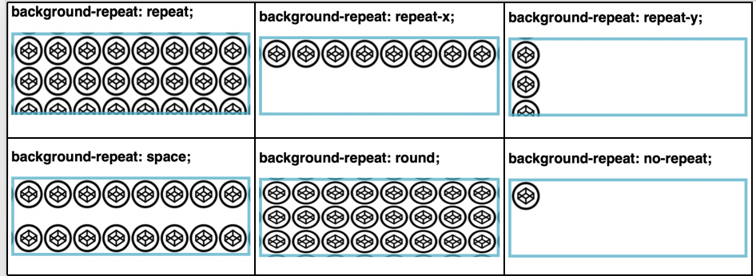
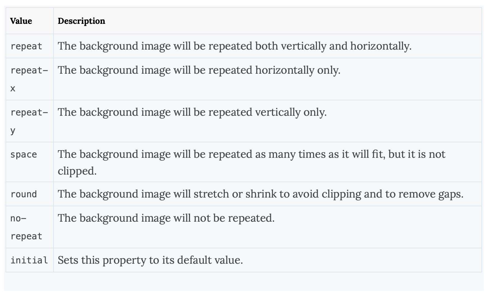
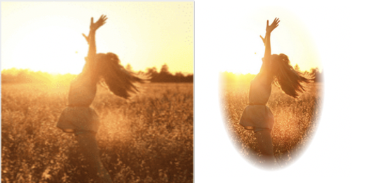
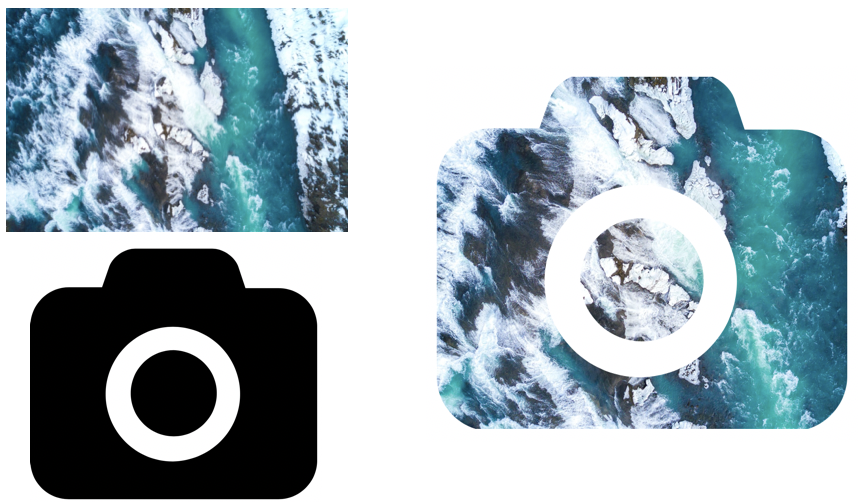
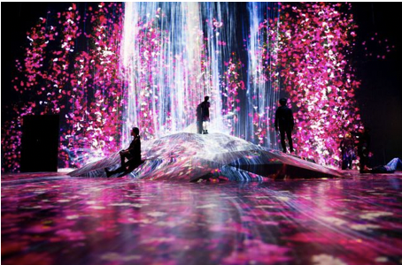
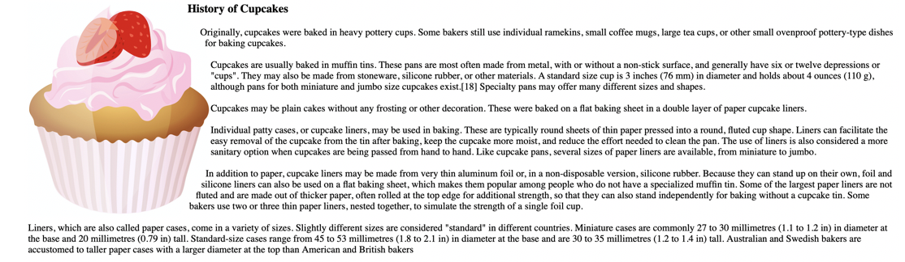

*This article shares some of my most pleasing moments of learning CSS, I hope it's the same for you as well.*

CSS is an abbreviated form of Cascading Style Sheet. It is used to describe how HTML elements should be displayed. CSS can not only provide colors, positions to the HTML elements, etc., but it can also create animations and enhance your web page. It's totally worth to know some useful tips and tricks which will help you to create amazing web pages.

## 1. background-repeat


<br>
The <font color ="#905"> <span style="background-color:#e1e2e3">background-repeat</span></font> property sets how a background image will be repeated. It is used in conjunction with the background-image property. We can repeat the background image along the horizontal axis, vertical axis or not repeat it at all.

*By default, a background-image is repeated both vertically and horizontally.*

<b>Syntax</b>
```CSS
background-repeat: value; 
```
<br>
<b>Property Values </b>
<br>

<b>CSS Example</b>

```CSS
body {
    background-image: url("images.png");
    background-repeat: repeat;
}
```
<i>You can view the source code<a href="https://github.com/nimritee/webpage_practices/tree/master/cssTricks/background-repeat" target="_blank"> here</a></i>.

## 2. mask-image


Let's say you want to use an image, but only want to show certain parts of it. You can achieve this using the <font color ="#905"><span style="background-color:#e1e2e3">mask-image</span></font> property. CSS masking allows us to define a mask shape which is then applied to the image. Anything that comes outside the mask shape is cut out, and the rest is displayed. It is pretty much works the same as masking in Photoshop.

*Anything that’s 100% black in the image mask will be completely visible, anything that’s 100% transparent will be completely hidden, and anything in-between will be partially masked in the image.*

Masking can be performed in two ways, **Masking using Gradients** and **Masking with images**.<br>

<b>CSS Example - Linear Gradient Masking</b>

```CSS
#masked{
-webkit-mask-image: linear-gradient(to bottom, transparent 5%, black 75%);
mask-image: linear-gradient(to bottom, transparent 5%, black 75%); 
}
```
In the above image, 1st part is the original image and second part is masked image with linear-gradient.

<b>CSS Example - Radial Gradient Masking</b>

```CSS
 #masked{
-webkit-mask-image: radial-gradient(ellipse 20% 90% at 27% 50%, black 40%, transparent 50%);
mask-image: radial-gradient(ellipse 20% 90% at 27% 50%, black 40%, transparent 50%);
 }
 ```
 In the below image, 1st part is the original image and second part is masked image with radial-gradient.



 <b>CSS Example - Masking with  Images</b>
 ```CSS
 #masked{
 -webkit-mask-image: url(https://images.png);
 mask-image: url(https://images.png);
 }
 ```
 In the below example, a background image is used to mask an image in the selected camera cutout shape.
 <br>
<i>You can view the source code<a href="https://github.com/nimritee/webpage_practices/tree/master/cssTricks/mask-images" target="_blank"> here</a></i>.

## 3. Zoom on hover

 <div class=hover_apply>
    
</div>
<style>
.hover_apply img:hover {
    transform: scale(1.1);
}
</style>
<br>
A zoom effect on images when users hovers over them makes the web pages more attractive. This kind of effect can be used in galleries, selling products where you need to enlarge the image so that customers can have a better view.

The CSS <font color ="#905"><span style="background-color:#e1e2e3">transform</span></font> property is used for enlargemnet of images with your selected scale amount.

 <b>Syntax</b>
 ```CSS
 transform: scale [transition-duration] [transition-timing-function] [transition-delay];
 ```

 <b>CSS Example</b>
 ```CSS
img:hover {
    transform: scale(1.1);
}
 ```
In the above example, the image zooms in on hovering.
<br>

<i>You can view the source code<a href="https://github.com/nimritee/webpage_practices/tree/master/cssTricks/zoom-on-hover" target="_blank"> here</a></i>.

## 4. scroll-snap-type

[](https://vimeo.com/419457225)
[![Little red ridning hood]](https://vimeo.com/419457225 "Little red riding hood - Click to Watch!")

 <br>

CSS <font color ="#905"> <span style="background-color:#e1e2e3">scroll-snap-type</span></font> property allows the developer to create well-controlled scroll experiences. This property can be used in the gallery section of the web-page.
Page scrolling in CSS is contolled by setting a <font color ="#905"> <span style="background-color:#e1e2e3">scroll-snap-type</span></font> property on a container element. . The scroll-snap-type decides scrolling has to be done i.e. either <b>x</b> or <b>y</b>.


<b>Syntax</b>
 ```CSS
 scroll-snap-type: [none | x | y] [mandatory | proximity];
 ```
*The `mandatory` means the browser has to snap to a snap point whenever the user stops scrolling.*
*The `proximity`  is less strict, it allows the browser to a snap point if it seems appropriate.* 


 <b>CSS Example</b>
 ```CSS
.y-scrolling {
      scroll-snap-type: y mandatory;
  }
 ```
 The above example shows, scroll-snap-type along Y axis with mandatory value. 
<br>

<i>You can view the source code<a href="https://github.com/nimritee/webpage_practices/tree/master/cssTricks/snap-scroll-type" target="_blank"> here</a></i>.

## 5. shape-outside

<br>

<font color ="#905"> <span style="background-color:#e1e2e3">shape-outside</span></font> changes the shape of the items that are wrapped around it, instead of being restricted to a rectangular box.`shape-outside` allows to shape the content in order to fit the image.

The <font color ="#905"> <span style="background-color:#e1e2e3">shape-outside</span></font>  property takes a basic shape and applies a shape function on the item. This property works only for <b>floated</b> elements.


<b>Syntax</b>
 ```CSS
shape-outside: values;
 ```
<b>Values</b>

 <b>CSS Example</b>
 ```CSS
img{
    shape-outside: circle(85% at 10% 50%) border-box;  
}
 ```
The above example shows, how the text is wrapped around the image using the circle function.
<br>

<i>You can view the source code<a href="https://github.com/nimritee/webpage_practices/tree/master/cssTricks/shape-outside" target="_blank"> here</a></i>.