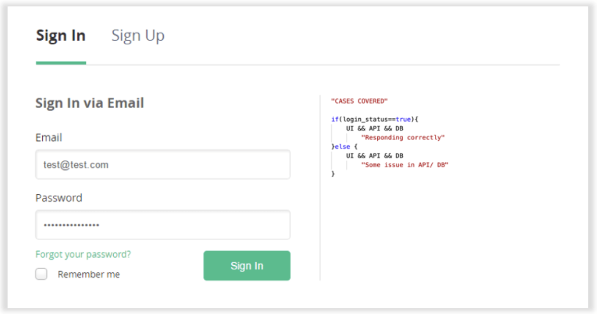
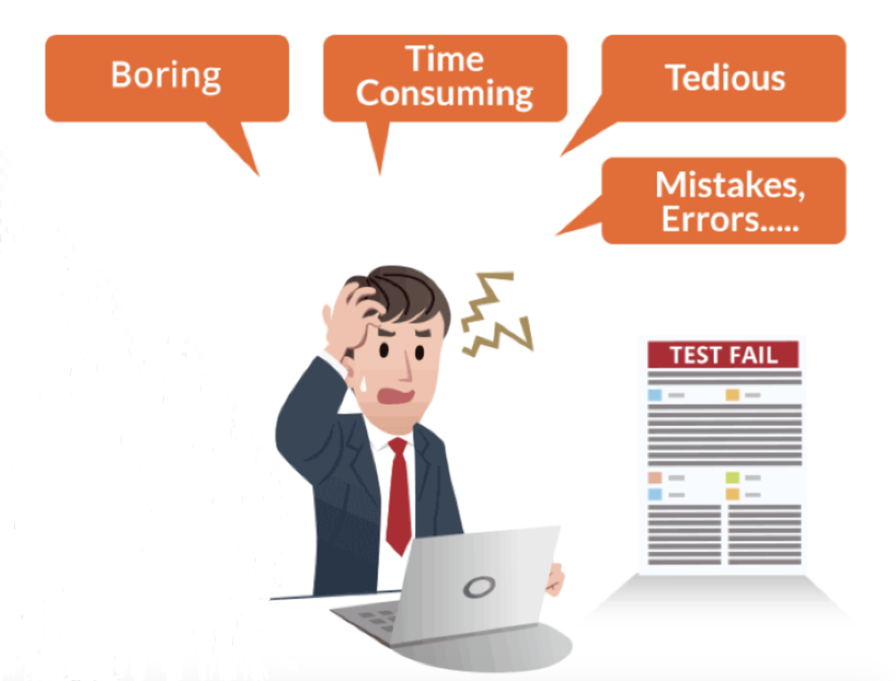
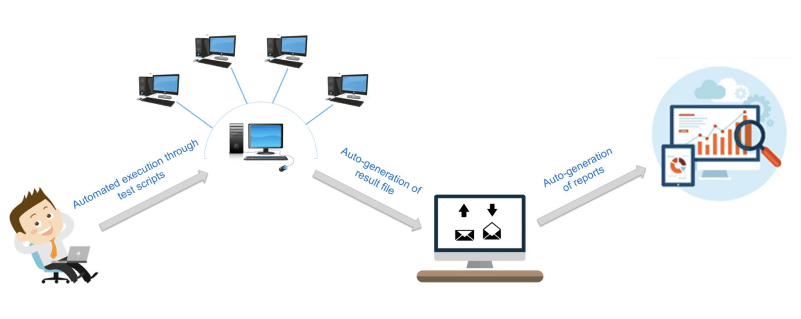
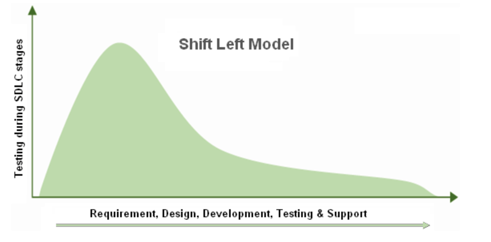
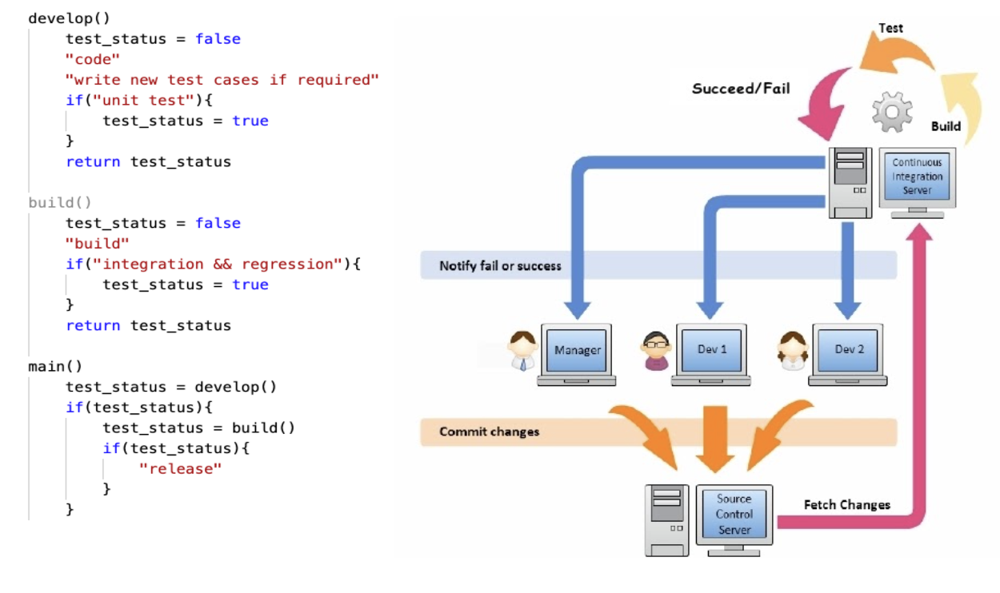
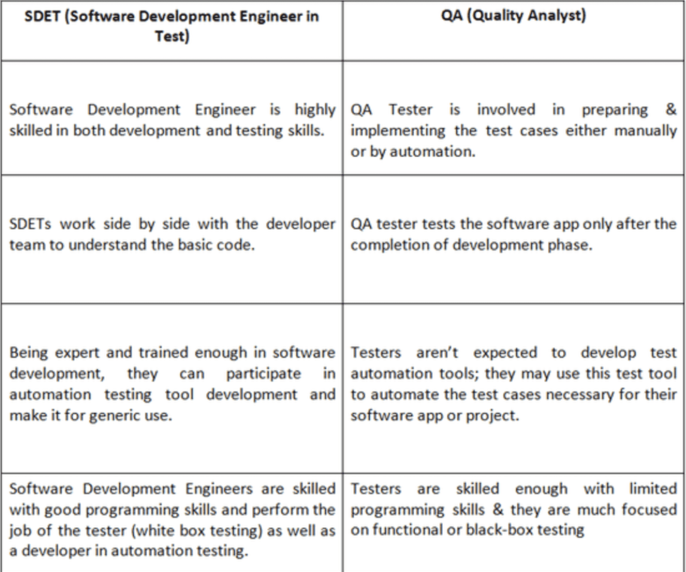
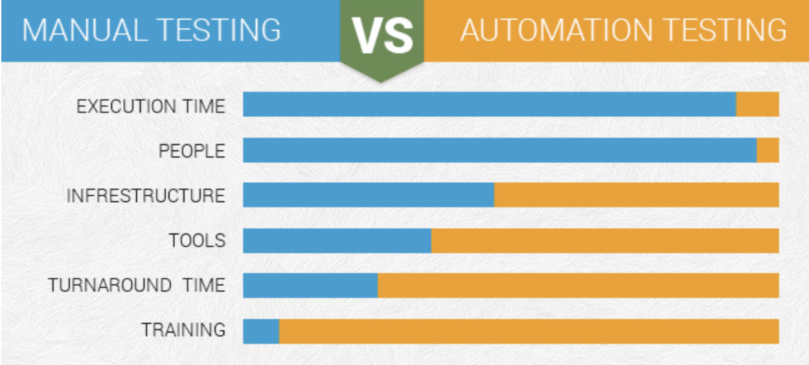

### Is Software Testing important?
Yes, Software Testing is an important phase of the Software Development Life Cycle (SDLC). 

### Why?
<b>Problem statement:</b>
1. Companies are expecting shorter release cycles to deliver new functionalities.
2. Provide stable and bug-free products to the customers.
3. Meet the expectations of customers by delivering the feature in short intervals.
4. Following the Agile development, we need to fix the issues at the earliest.
5. Make a fool proof system.
6. Shift left model (Testing should begin at the very early stage of SDLC).

### Example
(**Note**: Social Media platform examples will be used for explaining.) 
You download a social media application and try to “Sign Up” and an “Error” message shows up. Because of that same problem, none of the users could “Sign Up” and use the application. Now they have already started losing their business as users cannot use the application and are facing the unresolved issue at the very start. Thus, users will go and find another similar application that works and probably will never return to the previous one because of the bad experience they had.  

*A simple login test would have checked the system, database, and server avoiding such issues.*  

(Assuming test@test.com user exist)

### What are the different types of Testing?

1. <b>Unit Tests</b> 
The purpose of Unit Testing is to validate that each unit of the software code performs as expected. It is performed during the development phase of an application by the developers. Unit Test isolates a section of code and verifies its correctness. 
Ex: 
    - Once a login component/ module is developed.
    - Write all the test cases, regression tests which will validate the correctness of the module.

2. <b>Integration Tests</b> 
The purpose of Integration Testing is to combine individual units and test them as a group. It is performed to expose faults in the interaction between the integrated units. For example, it can be testing the interaction with the database or making sure that microservices work together as expected. 
Ex:
    - Once a news feed component is developed.
    - We will need to integrate it with Login as after login users will immediately land here.
    - Testing of the integrated components and their interdependency should be checked so that it doesn’t break the code. 

3. <b>Functional Tests</b> 
Functional Tests are used to validate the software system against functional requirements. The purpose of Functional Testing is to check the output of the system and not the intermediate states. The test would expect to get a specific value from the database as defined by the product requirements. 
Ex:
    - Once a search component is developed.
    - We will type some characters in the search box.
    - The result fetched should be relevant to the text searched.

4. <b>End-to-end Test</b> 
End-to-end testing replicates a user behavior to test whether the flow of an application right from start to finish is behaving as expected. The purpose of performing end-to-end tests is to identify system dependencies and to ensure that data integrity is maintained between various system components and systems. 
The entire application is tested for functionalities such as communicating with the other systems, interfaces, databases, networks, and other applications. 
Ex:
    - This will cover all the pages, feature’s, and functionality.
    - This should be performed before the code is pushed to the next stage, all the test cases have to be successful.

5. <b>Compatibility Testing</b> 
Compatibility Testing is performed to assure that the web application is capable of running on different hardware, operating system, network environments. We need to test if the application is able to function properly in different types of browsers. 
Ex:
    - This testing will help us know that the application is working stable across all different operating systems and browsers.

6. <b>Load Testing</b> 
A load test enables you to measure response times, throughput rates, resource-utilization levels and to identify your application’s breaking point, assuming that the breaking point occurs below the peak load condition. 
Ex:
    - Once the application is developed, it is necessary to know about the peak load condition the application can handle.
    - Therefore, load testing should be performed to know about the application’s threshold value.

### Why run tests manually which can be automated by the very machines we’re developing on? 

<table class="customTable">
  <thead>
    <tr>
      <th>Parameter</th>
      <th>Manual Testing</th>
      <th>Automated Testing</th>
    </tr>
  </thead>
  <tbody>
    <tr>
      <td><i class="fab fa-lg fa-linkedin"></i>Accuracy</td>
      <td>Manual Testing may not be accurate always.</td>
      <td>Automated Testing is highly accurate as compared to manual testing.</td>
    </tr>
    <tr>
      <td>Testing Time</td>
      <td>Manual Testing is time consuming as the tester has to check everything manually.</td>
      <td>Automated testing is faster as it operates on tools.</td>
    </tr>
    <tr>
      <td>Reliability</td>
      <td>Manual Testing is not very reliable, because of the human factor involved in it.</td>
      <td>Automated testing is comparatively more reliable.</td>
    </tr>
    <tr>
      <td>Regression Testing</td>
      <td>Very time consuming & complicated process to do it manually.</td>
      <td>Much easier with the help of tools.</td>
    </tr>
     <tr>
      <td>Budget</td>
      <td>Less expensive if considered for one time or short time goal.</td>
      <td>Expensive as it requires tools yet reasonable for long term.</td>
    </tr>
  </tbody>
</table>

### What is Selenium?
- Selenium is an open-source automated testing framework. It not only supports test scripts written in any user-preferred languages such as C#, Java, Perl, PHP, Python, and Ruby but also supports test case execution on multiple operating systems such as Windows, Linux, Android, and  Mac.
- Selenium provides high testing flexibility to write advanced and complex test cases and allows tests to be carried out using any browser: Mozilla Firefox, Internet Explorer, Google Chrome, Safari, or Opera. 
- Selenium can be integrated with TestNG and JUnit to generate test reports and manage test cases and with Jenkins, Docker, and Maven to attain continuous testing.

### Why is Selenium the Best Automation Testing Tool?
1. Selenium has extensive features unlike other tools for example it provides cross browser testing.
2. The purpose of testing is to compare the actual and expected output as well as the position of the elements in the UI.
3. This will also make us validate that other parts of the system like API, DB, Network, etc, are responding correctly.
4. Hence, Selenium can be used to perform different types of testing. Therefore, it removes the manual dependency of testers and the developers. So that they can run the script and validate all the steps themselves. This brings everything under one roof and makes it the most preferred and used tool for testing automation.

### Reporting in Selenium
Without reporting, all the hard work that you put into writing and executing your test cases will be lost if there’s no way to track the information and communicate it with others in your team. Selenium doesn’t support report generation, but it’s easy enough to do with the right tools. Few reporting tools that can be used along with selenium are:
- Selenium TestNG Report Generation
- Selenium JUnit Report Generation
- Selenium Extent Reports 

*Apart from the reporting tools, email can be sent using an API call or slack notifications.*

### How frequently should testing be performed?
Application testing should not only run before releasing a new feature but also it should run daily, within a period of 24 hours or 12 hours, depending on the organization.

We should make our test cycle so flexible that we can split the tests into:
1. <b>Login test</b> 
A Login test should run more frequently. Like after every 5 minutes or maximum up to an hour, as it's the most critical part of an application.

2. <b>Regression testing</b> 
Covers all different aspects of testing, edge cases, and functionality tests. This can run every day/ once every 3 days/ once every 7 days or as per the business requirements.

3. <b>Integration testing</b> 
Only specific feature’s testing along with its dependencies are performed when needed.

Referring to the above shift, now we have more time to resolve the discovered defects. That means if the tests are performed more often, we can find the defects sooner, thereby providing us more time to fix it. Thus, ensuring a smooth experience for the customers.
Therefore, it is advised to perform early and frequent tests. This can be achieved if we configure our code to work in such a manner and make the test cases parameter driven.

### Complete Process to be followed for Automating Test

Today companies are looking for developers who can take part in software development and at the same time, handle testing of the developed software, these developers are known as SDET engineers.

### Conclusion

1. To speed up the process, automation is required. This is known as DevOps.
2. Automation can save time, remove assumptions, and do wide test covers.
3. Manual testing has to be shifted to automated testing.
4. Automation can remove dependencies.
5. Selenium should be used for automation because it covers the maximum test cases.